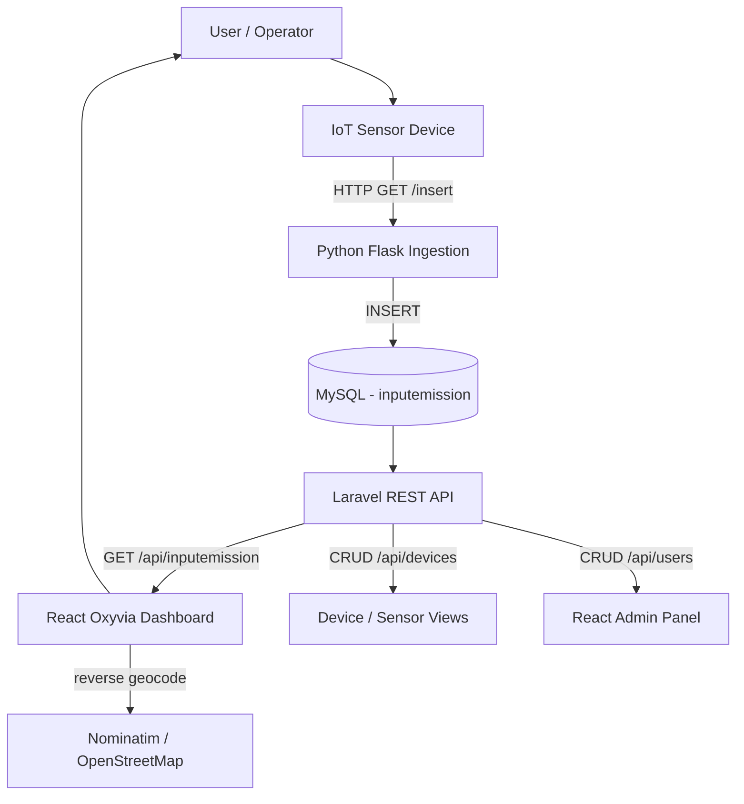
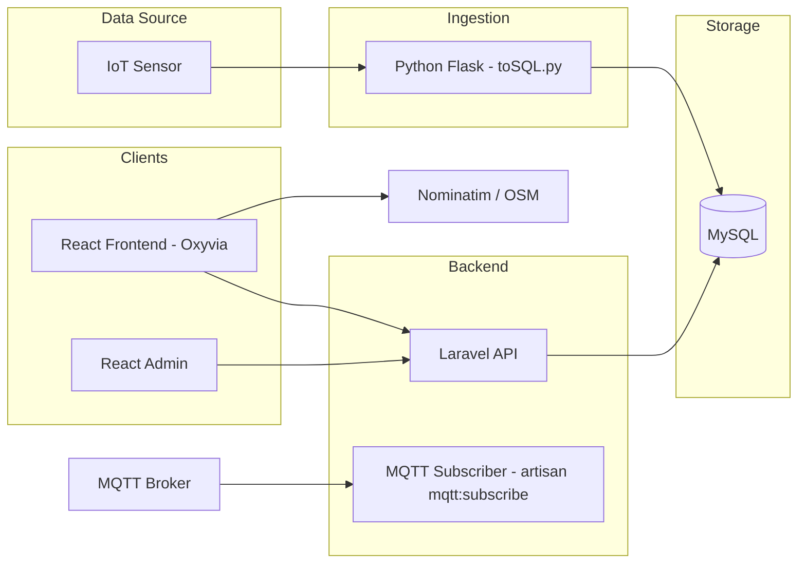
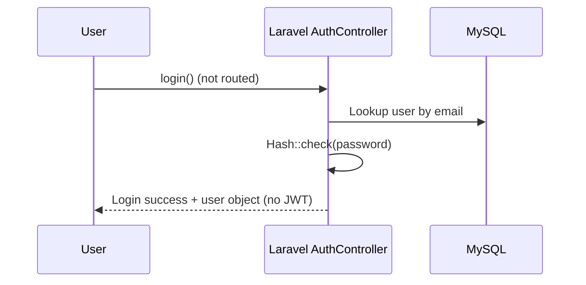

# Oxyvia — Carbon Emission & Energy Monitoring Platform

> A real-time IoT data ingestion and visualization platform that centralizes carbon-emission (CO₂) and energy sensor data into a clean, location-aware monitoring dashboard.

## Overview

Oxyvia is a **multi-service web platform** that collects energy-and-carbon sensor readings, stores them in a relational database, and presents them through role-differentiated web dashboards. It combines:

- a **Python ingestion service** that receives raw sensor parameters and persists them,
- a **Laravel REST API + MQTT subscriber** that performs data access, authentication, device management, and broker connectivity,
- a **React user dashboard** (`Oxyvia`) with real-time charts, geolocation, and a carbon-awareness chatbot,
- a **React admin interface** for managing users.

---

## What is This?

Oxyvia is a **real-time environmental/energy monitoring application**. (The UI footer and repository name reference the working title **"Kiansantang Broker MQTT"** — an IoT-based electrical-energy monitoring platform.) IoT-style sensors report voltage, current, power, energy, frequency, ambient temperature, object temperature, and CO₂ concentration. These readings flow through a small HTTP ingestion endpoint into MySQL, are later served by a Laravel API, and are rendered on a live-updating dashboard for a user, alongside per-user and per-city emission overviews.

It also ships a local **carbon-education chatbot** ("OxyBot" / "CarbonBot") that answers keyword-matched questions about carbon emissions and the greenhouse effect.

## Problem

- Sensor/energy data is produced continuously but is hard to view or act on in raw form.
- Understanding **personal vs. city-level carbon footprints** requires aggregating scattered data.
- There is no lightweight way to ingest rapid sensor HTTP payloads and persist them reliably.
- Users lack an accessible, friendly way to learn about carbon emissions in-context.

## Solution

Oxyvia provides an **end-to-end pipeline** from sensor ingestion to visualization:

1. A Python/Flask endpoint accepts sensor parameters over HTTP and writes them to MySQL (`inputemission`).
2. A Laravel API exposes that data, plus user and device management.
3. A real-time React dashboard polls the API and renders live CO₂ charts, status "plug" indicators, and geolocation-aware summaries.
4. Personal and city overviews aggregate emissions across devices/regions.
5. An embedded chatbot educates users on carbon topics without leaving the app.

---

## How It Works

### Product Flow



### System Architecture



> The MQTT subscriber stores received payloads using a `SensorReading` model that is **not present** in the current repository — see [Limitations](#limitations--known-issues).

### Data Flow

```text
IoT Sensor
  ↓  HTTP query params (voltage, current, power, ...)
Python Flask Service (toSQL.py)
  ↓  INSERT
MySQL (inputemission)
  ↓  SELECT (order by timestamp desc)
Laravel API  GET /api/inputemission
  ↓  JSON
React Dashboard (polls every 2s)
  ↓  render
Live CO₂ charts / status indicators / city & personal overviews
```

---

## Key Features

**Core (user dashboard — `frontend/`)**

- **Real-time sensor dashboard** — polls `/api/inputemission` every 2 seconds; renders the latest CO₂ reading and "Today's Highlight" cards (`voltage`, `current`, `power`, `energy`, `frequency`, ambient/object temperature) with color-coded plug status (Aman / Sedang / Bahaya / Kritis).
- **Daily CO₂ Overview chart** — area chart built from the last 24 readings (`recharts`).
- **Geolocation + city detection** — uses the browser geolocation API and OpenStreetMap Nominatim reverse-geocoding to label the user's location.
- **Personal & City Overviews** — tabbed aggregation of device data by individual and by city, with area charts (`OverviewPribadi`, `OverviewKota`, `Overview`).
- **Carbon chatbot** — keyword-matched local assistant ("OxyBot") answering questions about carbon emissions, greenhouse effect, and renewable energy.
- **Device / Sensor management** — CRUD against `/api/devices` (list, add, edit, delete).
- **User Profile & Settings** — profile statistics from `/api/devices`; settings form that creates users via `/api/users`.

**Administration (`frontend-admin/`)**

- **User list** — fetches and displays all users from `/api/users` in a table.

**Backend (`backend/` — Laravel)**

- **REST API** — user CRUD, device CRUD, input-emission read endpoint, chatbot reply. (`AuthController::login`/`register` exist as methods but are **not** routed.)
- **MQTT subscriber** — `php artisan mqtt:subscribe` connects to an MQTT broker and subscribes to a topic (persistence target model is currently missing — see caveat below).
- **JWT auth guard** — `tymon/jwt-auth` API guard configured in `config/auth.php`, but tokens are not issued on login.

**Ingestion (`python/`)**

- **HTTP sensor ingestion** — Flask endpoint `/insert` that writes sensor parameters to MySQL.

---

## Technology Stack

| Layer            | Technology (verified in repository)                                   |
| ---------------- | --------------------------------------------------------------------- |
| **Backend**      | PHP 8.2, Laravel 12, Guzzle, Laravel Tinker                            |
| **Auth**         | `tymon/jwt-auth` (JWT API guard configured)                            |
| **Messaging**    | `php-mqtt/laravel-client` (MQTT subscriber)                            |
| **Data Access**  | Eloquent ORM + raw `DB` query builder                                  |
| **Ingestion**    | Python, Flask, `mysql-connector-python`                                |
| **Frontend**     | React 19, Vite 7, Tailwind CSS 4, React Router 7                       |
| **Charts/UI**    | Recharts, Chart.js, react-chartjs-2, Framer Motion, lucide-react      |
| **Mapping**      | Leaflet, react-leaflet (installed), OpenStreetMap Nominatim (runtime)  |
| **HTTP Client**  | Axios                                                                    |
| **Database**     | MySQL (configured via `.env`); SQLite available as default fallback    |
| **Testing**      | Pest / Pest PHP, PHPUnit                                              |
| **Tooling**      | Laravel Pint, Laravel Sail, Composer                                   |

---

## Project Structure

```text
kiansantangbrokermqtt/
├── backend/            # Laravel REST API, MQTT subscriber, migrations, seeders
├── frontend/           # React user dashboard (Oxyvia)
├── frontend-admin/     # React admin interface (user management)
├── python/             # Flask sensor ingestion service (toSQL.py)
└── docs/               # Detailed technical documentation
```

| Directory        | Responsibility                                                            |
| ---------------- | ------------------------------------------------------------------------- |
| `backend/`       | REST API and business logic, auth, MQTT subscription, migrations/seeders  |
| `frontend/`      | Main user-facing monitoring/education web application                      |
| `frontend-admin/`| Lightweight admin app for viewing users                                    |
| `python/`        | Real-time HTTP ingestion service that writes sensor data to MySQL         |

---

## Authentication & Authorization

> **Status: configured but NOT fully functional.**

- The `api` guard is configured to use `jwt` (via `tymon/jwt-auth`) in `config/auth.php`.
- `AuthController` defines `login()` (validates with `Hash::check`) and `register()` (hashes with `Hash::make`), but **neither method is wired to a route** — `routes/api.php` does not define `/api/login` or `/api/register`.
- `AuthController::login` does **not** issue a JWT token even when reached.
- No route middleware guards the API endpoints, and the frontend `Login.jsx` (which posts to `/api/login`) is **not** referenced by the router.



**Consequence:** end-to-end login is currently unavailable from both the backend (no route) and the frontend (unrouted view). See [Limitations](#limitations--known-issues).

---

## API Overview

All endpoints below are verified in `backend/routes/api.php` (the only routes actually registered). The `AuthController` methods `login`/`register` are **not** exposed as routes.

### Data & Chat

| Method | Endpoint              | Purpose                                    |
| ------ | --------------------- | ------------------------------------------ |
| GET    | `/api/inputemission`  | List input-emission readings, newest first |
| POST   | `/api/chat`           | Get a keyword-matched chatbot reply        |

### Users (also used by admin panel)

| Method | Endpoint         | Purpose                         |
| ------ | ---------------- | ------------------------------- |
| GET    | `/api/users`     | List all users                  |
| POST   | `/api/users`     | Create a user                   |
| GET    | `/api/users/{id}`| Show a single user              |
| PUT    | `/api/users/{id}`| Update a user                   |
| DELETE | `/api/users/{id}`| Delete a user                   |

### Devices

| Method | Endpoint          | Purpose                     |
| ------ | ----------------- | --------------------------- |
| GET    | `/api/devices`    | List devices                |
| POST   | `/api/devices`    | Create a device             |
| PUT    | `/api/devices/{id}`| Update a device            |
| DELETE | `/api/devices/{id}`| Delete a device            |

Full details in [docs/api.md](docs/api.md).

---

## Database

- **Primary:** MySQL (per `backend/.env.example` → `energy_dashboard`).
- Migration-defined tables: `users`, `devices`.
- The `inputemission` table is referenced by the `InputEmission` model and populated by the **Python ingestion service**; it has **no migration** in this repository.

```mermaid
erDiagram
    USERS {
        int id PK
        string name
        string email UK
        string password
        int nomer
        string kecamatan
        string kelurahan
        int kodepos
        timestamps
    }
    DEVICES {
        int id PK
        string name
        timestamps
    }
    INPUTEMISSION {
        int id PK
        datetime timestamp
        decimal voltage
        decimal current
        decimal power
        decimal energy
        decimal frequency
        decimal powerFactor
        decimal tempAmbient
        decimal tempObject
        decimal CO2
    }
```

> The `inputemission` entity's schema is inferred from the `InputEmission` model fillable and the Python ingestion SQL — the table itself lacks a migration. See [docs/architecture.md](docs/architecture.md).

---

## My Contribution

The repository has a single `Initial commit` authored by `HidayahMF`. The following contribution breakdown is inferred from the codebase and **requires confirmation** where marked:

- Backend REST API & controllers (Laravel) — **VERIFIED present in repository**
- MQTT subscriber command — **VERIFIED present in repository**
- React user dashboard (frontend) — **VERIFIED present in repository**
- React admin interface (frontend-admin) — **VERIFIED present in repository**
- Python sensor ingestion service — **VERIFIED present in repository**
- Who authored each individual component — **NEEDS_CONFIRMATION** (only a single commit exists, with no per-file attribution)

---

## Engineering Challenges

**Real-time data freshness**  
Challenge: dashboards must reflect the latest sensor reading continuously.  
Implementation: the React dashboard polls the API every 2 seconds and renders the newest record.  
Result: near-real-time display without requiring an always-on socket. *(Potential consideration: this is polling-based, not pushed.)*

**Polyglot ingestion pipeline**  
Challenge: sensor payloads arrive as raw HTTP query parameters and must reach the dashboard reliably.  
Implementation: a Flask service parses query params and inserts into MySQL; the Laravel API reads the same table.  
Result: a language-separated ingestion → storage → API → UI path.

**MQTT reliability loop**  
Challenge: a broker connection can drop during long subscription loops.  
Implementation: `MqttSubscribe` wraps the loop in reconnect logic that disconnects and re-subscribes on error.  
Result: resilient subscription with retry/backoff. *(Note: the storage target model is currently missing — see Limitations.)*

**Location-aware labeling**  
Challenge: showing a meaningful emission location label.  
Implementation: browser geolocation + OpenStreetMap Nominatim reverse geocoding.  
Result: the dashboard displays the resolved city/country of the viewer.

---

## Development / Implementation Overview

The repository does not include a development-history log (single commit), so the following is an **implementation overview** rather than a chronological project history:

```text
Requirements (real-time emission monitoring + education)
  ↓
System / Architecture design (ingestion → storage → API → UI)
  ↓
Data layer (MySQL + Eloquent models; Python ingestion)
  ↓
Backend API (Laravel controllers + routes + MQTT subscriber)
  ↓
Frontend dashboards (React user app + admin app)
  ↓
Charts, geolocation, chatbot integration
  ↓
Testing setup (Pest / PHPUnit boilerplate)
  ↓
Deployment (environment-driven configuration)
```

---

## Testing

A **Pest / PHPUnit** test harness is configured in `backend/` (`phpunit.xml`, `tests/Pest.php`, `tests/TestCase.php`). The included tests are the default framework examples:

- `tests/Unit/ExampleTest.php` — asserts `true` is true.
- `tests/Feature/ExampleTest.php` — asserts a `GET /` returns 200.

No verified tests cover the application's controllers, MQTT subscriber, ingestion service, or React components. Frontend and Python services have **no automated test suite** in the repository.

---

## Deployment

### Verified

- Environment-driven configuration: `.env.example` (MySQL connection for `energy_dashboard`), `config/database.php`, `tymon/jwt-auth`, MQTT env vars (`MQTT_HOST`, `MQTT_PORT`, `MQTT_TOPIC`, etc. referenced in `MqttSubscribe`).
- Laravel Sail + Vite are available (`composer.json` dev scripts).
- The Python service binds to `0.0.0.0:5000` and would run directly via Python/Flask.

### Inferred

- Backend would be deployed as a standard PHP/Laravel app (needs `composer install`, `php artisan migrate`, and a web server/PHP built-in server), frontend apps built with `vite build` and served statically.

### Unknown

- No Dockerfile, `docker-compose.yml`, CI/CD config, or platform-specific deployment files (Vercel/Render/cPanel/Nginx configs) were found in the repository.

Not every detail of production deployment can be confirmed from the repository.

---

## Installation

> Prerequisites: PHP 8.2+, Composer, Node.js 18+ / npm, MySQL (or SQLite), Python 3 + pip. The frontends expect the Laravel API at `http://127.0.0.1:8000`.

### Backend (Laravel)

```bash
cd backend
composer install
cp .env.example .env
php artisan key:generate
php artisan migrate --seed
php artisan serve          # serves API on http://127.0.0.1:8000
```

### Frontend (User Dashboard)

```bash
cd frontend
npm install
npm run dev                # Vite dev server
```

### Frontend (Admin)

```bash
cd frontend-admin
npm install
npm run dev
```

### Python Ingestion Service

```bash
cd python
pip install flask mysql-connector-python
python toSQL.py            # serves on 0.0.0.0:5000
# Example insert: http://localhost:5000/insert?voltage=220&current=1.5&power=330&energy=2&freq=50&pf=0.9&ambient=28&object=32&CO2=180
```

### MQTT Subscriber (optional)

```bash
cd backend
# set MQTT_HOST, MQTT_PORT, MQTT_TOPIC in .env
php artisan mqtt:subscribe
```

---

## Environment Variables

### Backend (`backend/.env`)

| Variable         | Purpose                                    | Example                |
| ---------------- | ------------------------------------------ | ---------------------- |
| `DB_CONNECTION`  | Database driver                            | `mysql`                |
| `DB_HOST`        | Database host                              | `127.0.0.1`            |
| `DB_PORT`        | Database port                              | `3306`                 |
| `DB_DATABASE`    | Database name                              | `energy_dashboard`     |
| `DB_USERNAME`    | Database user                              | `root`                 |
| `DB_PASSWORD`    | Database password                          |                        |
| `ADMIN_EMAIL`    | Admin email seeded by UserSeeder           | *(set at runtime)*     |
| `ADMIN_PASSWORD` | Admin password seeded by UserSeeder        | *(set at runtime)*     |
| `SANCTUM_STATEFUL_DOMAINS` | Stateful API domain (sample)      | `localhost:5175`       |
| `MQTT_HOST`      | MQTT broker host (used by subscriber)      | *(not in .env.example)*|
| `MQTT_PORT`      | MQTT broker port                           | `1883`                 |
| `MQTT_TOPIC`     | Topic to subscribe to                      | `sensors/temperature`  |
| `MQTT_USER`      | MQTT username                              |                        |
| `MQTT_PASS`      | MQTT password                              |                        |

### Python (`python/toSQL.py`)

The ingestion service reads its MySQL configuration from environment variables: `DB_HOST`, `DB_USER`, `DB_PASSWORD`, `DB_NAME`. Credentials are **not** stored in the script. Copy `python/.env.example` to `python/.env` (or export the variables) and set `DB_PASSWORD` before running.

> Frontend API URLs are currently **hardcoded** (e.g. `http://127.0.0.1:8000`) rather than read from environment variables.

---

## Screenshots

Screenshots are not yet included in the repository. Add images under `docs/screenshots/` and reference them:

```text
<!-- SCREENSHOT: Real-time CO₂ Dashboard -->


<!-- SCREENSHOT: Personal & City Overview -->


<!-- SCREENSHOT: Carbon Chatbot (OxyBot) -->


<!-- SCREENSHOT: Admin User List -->

```

---

## Security

- **Database credentials are provided through environment variables** — the Python ingestion service reads `DB_HOST`, `DB_USER`, `DB_PASSWORD`, and `DB_NAME` from the environment, and the Laravel backend reads all DB settings from `backend/.env`. No real credentials are stored in source code.
- **`.env` files must never be committed** — they are excluded by the root and folder-level `.gitignore` files. Only `.env.example` files (placeholders only) are tracked.
- **The admin account is seeded from `ADMIN_EMAIL` / `ADMIN_PASSWORD`** environment variables. There is no default admin password.
- **Sensitive production credentials must be rotated independently** — if a credential was ever exposed (e.g. in earlier git history), rotate it and remove it from history before publishing.

---

## Limitations / Known Issues

- **Missing `SensorReading` model** — `backend/app/Console/Commands/MqttSubscribe.php` uses `App\Models\SensorReading`, which is not defined in this repository; the subscriber would fail at runtime unless the model/table is added.
- **`inputemission` has no migration** — the table is created/populated externally by the Python service; `php artisan migrate` alone will not create it.
- **JWT not issued at login** — `AuthController::login` returns the user object but does not generate/return a JWT token despite the `jwt` guard being configured.
- **Login/register routes not registered** — `routes/api.php` does not define `/api/login` or `/api/register`, so the `AuthController` methods are unreachable via the API.
- **Login view not wired in frontend** — `Login.jsx` exists but is not referenced by the router; the dashboard layout is the primary entry point.
- **Backend chatbot dataset missing** — `ChatbotController` reads `dataset/chatbot_dataset.json`, which is not present; the frontend chatbot (OxyBot) instead uses an inline keyword dataset in `frontend/src/constant/index.js`.
- **Hardcoded API base URLs** — real-time polling and CRUD hit fixed `http://127.0.0.1:8000`/`localhost:8000`.
- **Sample factory data disabled** — `UserSeeder` previously created sample users via `User::factory(5)->create()`, but the factory does not populate every required `users` column (`nomer`, `kecamatan`, `kelurahan`, `kodepos`); this call is commented out to avoid a runtime error.
- **Mock data in `frontend/src/context/DataContext.jsx`** — device/user overview data is defined as static in-context arrays; several views fetch live data directly via Axios instead.

---

## Future Improvements

- Add a migration for the `inputemission` table and a `SensorReading` model/migration to complete the MQTT path.
- Wire JWT token issuance and route-level authorization middleware.
- Backend-service the chatbot via a persisted dataset file.
- Externalize API base URLs and database credentials via environment variables.
- Add automated tests (API/Feature tests, frontend component tests, ingestion service tests).
- Provide Docker / Docker Compose for one-command local environment.
- Optionally replace 2-second polling with WebSockets/SSE for true push updates.

---

## Author

**Hidayah Muhammad** (`HidayahMF`) — repository maintainer (single initial commit).

---

## Documentation

- [docs/project-overview.md](docs/project-overview.md)
- [docs/product-flow.md](docs/product-flow.md)
- [docs/architecture.md](docs/architecture.md)
- [docs/api.md](docs/api.md)
- [docs/development-pipeline.md](docs/development-pipeline.md)
