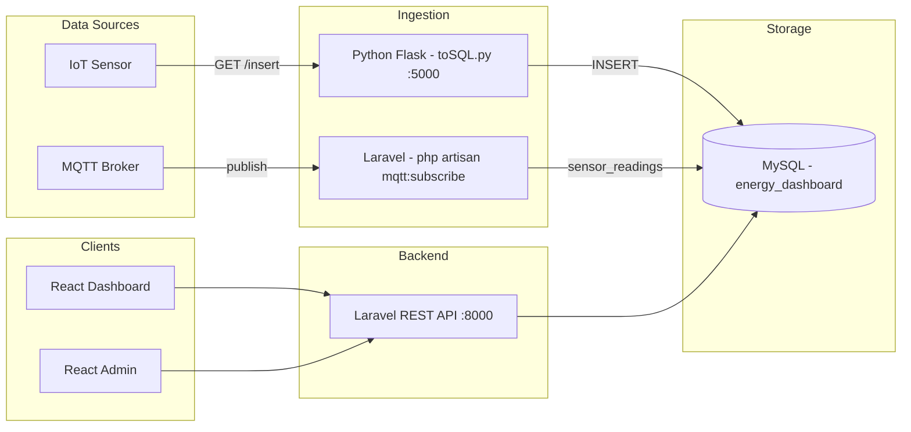

# Kian Santang Broker MQTT — Carbon Emission & Energy Monitoring Platform

> Real-time IoT telemetry platform that ingests carbon-emission (CO₂) and energy sensor readings, stores them in MySQL, and presents them on live dashboards with user/device management and a carbon-education chatbot.

Working title **"Oxyvia"** — an IoT-based electrical-energy monitoring platform.

---

## Overview

This is a **multi-service system** that takes raw sensor readings (voltage, current, power, energy, frequency, ambient/object temperature, CO₂) and turns them into a clean, location-aware monitoring dashboard.

- A **Python (Flask) ingestion service** receives sensor payloads over HTTP and writes them to MySQL.
- A **Laravel 12 REST API + MQTT subscriber** serves the data, manages users/devices, issues JWT tokens, and subscribes to an MQTT broker.
- A **React user dashboard** polls the API and renders real-time CO₂ charts, per-city/per-user overviews, device management, and an embedded chatbot.
- A **React admin app** lists users.

## Key Features

- **Real-time sensor dashboard** — polls `GET /api/inputemission` every 2s; renders the latest CO₂ reading, "Today's Highlight" cards, and status indicators.
- **Daily CO₂ chart** — area chart from the last 24 readings (Recharts).
- **Geolocation + city detection** — browser geolocation + OpenStreetMap Nominatim reverse geocoding.
- **Personal & city overviews** — tabbed aggregation of readings.
- **Carbon chatbot ("OxyBot")** — keyword-matched answers about carbon emissions and the greenhouse effect.
- **Device / sensor management** — full CRUD against `/api/devices`.
- **User profile & settings** — profile view plus user creation via `/api/users`.
- **Admin view** — the admin app lists all users from `/api/users`.
- **JWT authentication** — `POST /api/login` and `POST /api/register` issue signed JWT tokens (`tymon/jwt-auth`).
- **MQTT ingestion** — `php artisan mqtt:subscribe` subscribes to a broker topic and persists messages.

## Architecture



> The Python HTTP service and the Laravel MQTT subscriber are the two ingestion paths; both write to the same MySQL database that the API reads.

## System Flow

```text
IoT Sensor
  ↓  HTTP query params (voltage, current, power, energy, freq, pf, ambient, object, CO2)
Python Flask Service (toSQL.py, :5000)
  ↓  INSERT INTO inputemission
MySQL (energy_dashboard)
  ↓  SELECT ... ORDER BY timestamp DESC
Laravel API — GET /api/inputemission
  ↓  JSON
React Dashboard (polls every 2s)
  ↓
Live CO₂ charts / status indicators / city & personal overviews
```

## MQTT Integration

The Laravel backend acts as an **MQTT client/subscriber** (it does not expose MQTT over HTTP). `php artisan mqtt:subscribe`:

- connects to the broker configured via `MQTT_HOST` / `MQTT_PORT`;
- subscribes to `MQTT_TOPIC` at **QoS 0** with a 10s keep-alive;
- decodes each message as JSON and persists `{ topic, payload }` to the `sensor_readings` table;
- reconnects automatically if the message loop errors.

The broker role, QoS, topics, and payload format are documented in [docs/api.md — MQTT Integration](docs/api.md).

## API

Base URL: `http://127.0.0.1:8000` (local development; frontends read `VITE_API_BASE_URL`, defaulting to this value).

| Method | Endpoint | Description |
| ------ | -------- | ----------- |
| POST | `/api/register` | Register a user, returns a JWT token |
| POST | `/api/login` | Authenticate, returns a JWT token |
| GET | `/api/inputemission` | List sensor readings, newest first |
| POST | `/api/chat` | Keyword-matched chatbot reply |
| GET / POST | `/api/users` | List / create users |
| GET / PUT / PATCH / DELETE | `/api/users/{id}` | Show / update / delete a user |
| GET / POST | `/api/devices` | List / create devices |
| GET / PUT / PATCH / DELETE | `/api/devices/{id}` | Show / update / delete a device |

**Python ingestion** (separate service, port 5000): `GET /insert?voltage=...&current=...&power=...&energy=...&freq=...&pf=...&ambient=...&object=...&CO2=...`

Full request/response and error documentation: [docs/api.md](docs/api.md).

## Frontend

- `frontend/` — React 19 + Vite 7 + Tailwind 4 dashboard (charts via Recharts/Chart.js, maps via Leaflet).
- `frontend-admin/` — lightweight React app that lists users from `/api/users`.

Both apps read the API URL from the `VITE_API_BASE_URL` environment variable (see `.env.example`). The dashboard's chatbot is a client-side keyword matcher; the backend `POST /api/chat` endpoint provides the same behaviour on the server.

## Technology Stack

| Layer | Technology |
| ----- | ---------- |
| Backend | PHP 8.2+, Laravel 12 |
| Auth | `tymon/jwt-auth` (JWT `api` guard) |
| Messaging | `php-mqtt/laravel-client` (MQTT subscriber) |
| Ingestion | Python 3, Flask, `mysql-connector-python` |
| Frontend | React 19, Vite 7, Tailwind CSS 4, Axios |
| Charts / UI | Recharts, Chart.js, Framer Motion, lucide-react |
| Mapping | Leaflet (client) + OpenStreetMap Nominatim (runtime) |
| Database | MySQL (SQLite supported as a local fallback) |
| Testing | Pest / PHPUnit, `pdo_sqlite` for in-memory DB tests |

## Database

Tables are defined by migrations in `backend/database/migrations/`:

| Table | Purpose | Migration |
| ----- | ------- | --------- |
| `users` | User accounts (login/register + profile) | ✅ |
| `devices` | Sensor devices (managed via the dashboard) | ✅ |
| `inputemission` | Sensor readings written by the Python service | ✅ |
| `sensor_readings` | MQTT messages stored by the subscriber | ✅ |

`php artisan migrate` creates all tables. Point `DB_DATABASE` (backend) and `DB_NAME` (Python) at the **same** database so the API reads what ingestion writes.

## Setup

Prerequisites: PHP 8.2+, Composer, Node.js 18+, Python 3 + pip, MySQL (or SQLite).

### Backend

```bash
cd backend
composer install
cp .env.example .env
php artisan key:generate
# set DB credentials + ADMIN_EMAIL/ADMIN_PASSWORD + JWT_SECRET in .env
php artisan migrate
php artisan serve        # API on http://127.0.0.1:8000
```

### Frontends

```bash
cd frontend          # user dashboard
cp .env.example .env
npm install
npm run dev

cd frontend-admin    # admin app
cp .env.example .env
npm install
npm run dev
```

### Python ingestion service

```bash
cd python
pip install flask mysql-connector-python
cp .env.example .env   # set DB_PASSWORD; DB_NAME must match the backend DB
python toSQL.py        # serves on 0.0.0.0:5000

# Example insert into the `inputemission` table:
curl "http://127.0.0.1:5000/insert?voltage=220&current=1.5&power=330&energy=10&freq=50&pf=0.95&ambient=25&object=32&CO2=180"
```

### MQTT subscriber (optional)

```bash
cd backend
# set MQTT_HOST, MQTT_PORT, MQTT_TOPIC, (MQTT_USER/MQTT_PASS if required) in .env
php artisan mqtt:subscribe
```

## Testing

```bash
cd backend
php artisan test
```

The suite (Pest) runs against an **in-memory SQLite** database and covers:

- User CRUD — create, duplicate-email rejection, show, update (PUT/PATCH), delete, 404s.
- Device CRUD — list, create, show, update (PUT/PATCH), delete, 404s.
- Auth — register returns a token, duplicate-email rejection, login success, invalid-credentials 401, input validation.
- Chat — matched reply, fallback reply, case-insensitive matching, graceful 503 when the dataset is missing.
- Input emission — newest-first ordering, empty result set.
- MQTT — payload parsing (JSON vs raw).

## Configuration

Environment variables (see `backend/.env.example`, `python/.env.example`, `frontend/.env.example`, `frontend-admin/.env.example`):

| Variable | Purpose |
| -------- | ------- |
| `DB_CONNECTION`, `DB_HOST`, `DB_PORT`, `DB_DATABASE`, `DB_USERNAME`, `DB_PASSWORD` | Laravel database connection |
| `ADMIN_EMAIL`, `ADMIN_PASSWORD` | Bootstrap admin account created by the seeder |
| `JWT_SECRET` | Secret used to sign JWT tokens |
| `CORS_ALLOWED_ORIGINS` | Comma-separated list of allowed browser origins |
| `MQTT_HOST`, `MQTT_PORT`, `MQTT_TOPIC`, `MQTT_USER`, `MQTT_PASS`, `MQTT_KEEP_ALIVE` | Broker settings for the MQTT subscriber |
| `CHATBOT_DATASET` | Override the chatbot dataset path |
| `VITE_API_BASE_URL` | API base URL used by the React apps |

## Security

- Database and broker credentials are read from environment variables — no secrets are stored in source code, and `.env` files are gitignored (only `.env.example` placeholders are tracked).
- The admin account is seeded only from `ADMIN_EMAIL` / `ADMIN_PASSWORD`; there is no default password.
- Passwords are hashed with bcrypt and never returned by the API (the `User` model hides the `password` field).
- JWT auth uses a per-environment `JWT_SECRET`.
- CORS is intentionally restricted; `CORS_ALLOWED_ORIGINS` defaults to the local Vite origins.

## Known Limitations

- QoL: `GET /api/devices/{id}` requires the device to exist (404 otherwise) — standard route-model binding.
- `POST /api/register` creates the full user profile (name, email, password, and the address fields) because the `users` table requires those columns.
- Live MQTT flow is verified via the subscriber's reconnect/persistence code and unit-tested payload parsing; it requires a reachable broker to run end-to-end.
- The dashboard polls on a 2-second interval rather than using push (SSE/WebSocket).

## Future Improvements

- Protect the data endpoints with the JWT guard (currently reads are public; auth issues valid tokens).
- Serve the dashboard chatbot from `POST /api/chat` instead of the inline dataset.
- Add Docker Compose for a one-command local environment.
- Add frontend component tests.
- Replace 2s polling with SSE/WebSockets for true push updates.

## Author

**Hidayah Muhammad** (`HidayahMF`) — repository maintainer.

## Documentation

- [docs/api.md](docs/api.md) — complete API reference
- [docs/project-overview.md](docs/project-overview.md)
- [docs/product-flow.md](docs/product-flow.md)
- [docs/architecture.md](docs/architecture.md)
- [docs/development-pipeline.md](docs/development-pipeline.md)