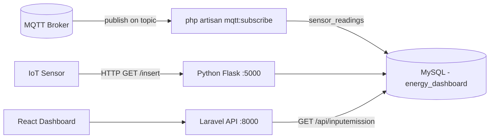

# API Documentation — Kian Santang Broker MQTT (Oxyvia)

Oxyvia is an IoT data platform that collects carbon-emission (CO₂) and energy sensor readings, stores them in MySQL, and serves them to browser dashboards through a Laravel REST API. Sensor hardware reports readings over HTTP to a Python (Flask) ingestion service; the Laravel API exposes that data — together with JWT authentication, user and device management, and a keyword-matched carbon chatbot — to two React applications.

This document describes the **callable endpoints registered in the repository**, with request/response shapes and status codes as implemented.

---

## Table of Contents

- [Services & Base URLs](#services--base-urls)
- [API Overview](#api-overview)
- [Authentication](#authentication)
- [Endpoint Reference](#endpoint-reference)
- [Python Ingestion Service](#python-ingestion-service)
- [MQTT Integration](#mqtt-integration)
- [Frontend Integration](#frontend-integration)
- [Validation Rules](#validation-rules)
- [Error Handling](#error-handling)
- [Current Limitations](#current-limitations)

---

## Services & Base URLs

The system runs three cooperating services. The URLs below are the **local development** URLs configured in the repository; no production URLs are defined.

| Service                      | Base URL            | How to start it                                              |
| ---------------------------- | ------------------- | ------------------------------------------------------------ |
| Laravel REST API             | `http://127.0.0.1:8000` | `cd backend && php artisan serve`                         |
| Python ingestion service     | `http://127.0.0.1:5000` | `cd python && python toSQL.py`                             |
| MQTT broker (external)       | configurable via `.env` | `cd backend && php artisan mqtt:subscribe` |

- All Laravel endpoints live under the `/api` prefix, e.g. `GET http://127.0.0.1:8000/api/inputemission`.
- The Python ingestion service listens on port `5000` and is a separate HTTP server (see [Python Ingestion Service](#python-ingestion-service)).
- The MQTT broker is not an HTTP API — it is consumed by the Laravel subscriber (see [MQTT Integration](#mqtt-integration)).

The React frontends read the API base URL from the `VITE_API_BASE_URL` environment variable (default `http://127.0.0.1:8000`). See [Frontend Integration](#frontend-integration).

---

## API Overview

All endpoints below are registered in `backend/routes/api.php` (Laravel) or `python/toSQL.py` (Flask).

### Authentication

| Method | Endpoint          | Description                              |
| ------ | ----------------- | ---------------------------------------- |
| POST   | `/api/register`   | Register a user and receive a JWT token  |
| POST   | `/api/login`      | Authenticate and receive a JWT token     |

### Data & Chat

| Method | Endpoint             | Description                                   |
| ------ | -------------------- | --------------------------------------------- |
| GET    | `/api/inputemission` | List sensor readings, newest first           |
| POST   | `/api/chat`          | Get a keyword-matched chatbot reply           |

### Users (also used by the admin app)

| Method | Endpoint             | Description        |
| ------ | -------------------- | ------------------ |
| GET    | `/api/users`         | List all users     |
| POST   | `/api/users`         | Create a user      |
| GET    | `/api/users/{id}`    | Show a single user |
| PUT/PATCH | `/api/users/{id}` | Update a user      |
| DELETE | `/api/users/{id}`    | Delete a user      |

### Devices

| Method | Endpoint             | Description        |
| ------ | -------------------- | ------------------ |
| GET    | `/api/devices`       | List devices       |
| POST   | `/api/devices`       | Create a device    |
| GET    | `/api/devices/{id}`  | Show a single device |
| PUT/PATCH | `/api/devices/{id}` | Update a device  |
| DELETE | `/api/devices/{id}`  | Delete a device    |

### Python Ingestion Service

| Method | Endpoint  | Description                                       |
| ------ | --------- | ------------------------------------------------- |
| GET    | `/insert` | Ingest one sensor reading via query parameters    |

---

## Authentication

Authentication is provided by **JSON Web Tokens** signed with `tymon/jwt-auth`. `POST /api/register` and `POST /api/login` issue a token; clients should send it as an `Authorization: Bearer <token>` header when accessing protected endpoints.

> **Current scope:** the login/register endpoints are fully functional and tested. The data endpoints (`/api/users`, `/api/devices`, `/api/inputemission`, `/api/chat`) are currently **public** — they do not require a token. See [Current Limitations](#current-limitations).

### POST /api/register

#### Description

Creates a new user and returns a JWT token. The user profile includes an Indonesian-style address (phone `nomer`, `kecamatan`, `kelurahan`, `kodepos`) because the `users` table requires the full profile.

#### Request

```json
{
  "name": "Dimas Prasetyo",
  "email": "dimas@example.com",
  "password": "secret123",
  "nomer": 81234567,
  "kecamatan": "Coblong",
  "kelurahan": "Dago",
  "kodepos": 40135
}
```

All fields are required. The password is hashed (bcrypt) and never returned.

#### Response

`201 Created`:

```json
{
  "message": "Register success",
  "token": "<jwt>",
  "user": {
    "id": 1,
    "name": "Dimas Prasetyo",
    "email": "dimas@example.com",
    "nomer": 81234567,
    "kecamatan": "Coblong",
    "kelurahan": "Dago",
    "kodepos": 40135,
    "created_at": "2026-08-27T10:00:00.000000Z",
    "updated_at": "2026-08-27T10:00:00.000000Z"
  }
}
```

#### Status Codes

| Status | Meaning                                    |
| ------ | ------------------------------------------ |
| 201    | Created — token + user object              |
| 422    | Validation failed (e.g. duplicate email)   |
| 500    | Server error                               |

---

### POST /api/login

#### Description

Authenticates a user by email/password and returns a JWT token.

#### Request

```json
{
  "email": "dimas@example.com",
  "password": "secret123"
}
```

#### Response

`200 OK`:

```json
{
  "message": "Login success",
  "token": "<jwt>",
  "user": {
    "id": 1,
    "name": "Dimas Prasetyo",
    "email": "dimas@example.com"
  }
}
```

#### Status Codes

| Status | Meaning                                      |
| ------ | -------------------------------------------- |
| 200    | Success — token + user object                |
| 401    | `{ "message": "Invalid credentials" }`       |
| 422    | Validation failed (email/password missing)   |
| 500    | Server error                                 |

---

## Endpoint Reference

### GET /api/inputemission

#### Description

Returns all input-emission sensor readings ordered from **newest to oldest by `timestamp`**.

Implementation: `InputEmission::orderBy('timestamp', 'desc')->get()`.

There is **no pagination, filtering, or query-parameter support**. Every stored reading is returned in a single JSON array.

#### Request

```
GET /api/inputemission
```

No request body. No query parameters.

#### Response

`200 OK` — a JSON array of reading objects:

```json
[
  {
    "id": 42,
    "timestamp": "2026-08-27 10:30:00",
    "voltage": 220.4,
    "current": 1.5,
    "power": 330.0,
    "energy": 10.2,
    "frequency": 50.0,
    "powerFactor": 0.95,
    "tempAmbient": 28.0,
    "tempObject": 32.5,
    "CO2": 180.0
  }
]
```

When no readings exist, the response is an empty array `[]`.

#### Status Codes

| Status | Meaning                              |
| ------ | ------------------------------------ |
| 200    | Success — JSON array of readings     |
| 500    | Server error (e.g. database failure) |

---

### POST /api/chat

#### Description

Returns a keyword-matched chatbot reply for the given message. The message is lowercased and compared against the keyword list in `backend/dataset/chatbot_dataset.json` (a JSON array of `{ keywords: [], reply: "" }` objects). The first keyword match wins; if nothing matches, a default fallback reply is returned.

The dataset ships with the repository; the path can be overridden via the `CHATBOT_DATASET` environment variable.

#### Request

```json
{
  "message": "apa itu emisi karbon?"
}
```

`message` is the only accepted field. There is **no validation** — a missing or empty `message` simply matches no keyword and returns the fallback reply.

#### Response

`200 OK` — a JSON object with a single `reply` field:

```json
{
  "reply": "Emisi karbon adalah gas CO₂ yang dilepaskan ke atmosfer akibat aktivitas manusia seperti kendaraan bermotor, industri, dan pembangkit listrik."
}
```

#### Status Codes

| Status | Meaning                                                        |
| ------ | -------------------------------------------------------------- |
| 200    | Success — matched or fallback reply                            |
| 503    | Chatbot dataset missing/unreadable (`{ "message": "Chatbot dataset is not available." }`) |
| 500    | Server error                                                   |

---

### Users

Users are managed through a standard resource controller (`UserController`). The `User` model masks the `password` field, so passwords are **never included in any response**.

#### GET /api/users

##### Description

Lists all users.

##### Request

```
GET /api/users
```

No body.

##### Response

`200 OK` — a JSON array of user objects:

```json
[
  {
    "id": 1,
    "name": "Dimas Prasetyo",
    "email": "dimas@example.com",
    "nomer": 81234567,
    "kecamatan": "Coblong",
    "kelurahan": "Dago",
    "kodepos": 40135,
    "created_at": "2026-08-20T09:00:00.000000Z",
    "updated_at": "2026-08-20T09:00:00.000000Z"
  }
]
```

##### Status Codes

| Status | Meaning                       |
| ------ | ----------------------------- |
| 200    | Success — JSON array of users |
| 500    | Server error                  |

---

#### POST /api/users

##### Description

Creates a new user. The password is hashed (bcrypt) before storage; the response never contains it.

All fields are **required**.

##### Request

```json
{
  "name": "Dimas Prasetyo",
  "email": "dimas@example.com",
  "password": "secret123",
  "nomer": 81234567,
  "kecamatan": "Coblong",
  "kelurahan": "Dago",
  "kodepos": 40135
}
```

##### Response

`201 Created` — the created user object (password excluded).

##### Status Codes

| Status | Meaning                        |
| ------ | ------------------------------ |
| 201    | Created — the new user object  |
| 422    | Validation failed              |
| 500    | Server error                   |

##### Validation

- `name`, `email`, `password`, `nomer`, `kecamatan`, `kelurahan`, `kodepos` all required.
- `email` must be valid and **unique** in `users`.
- `password` minimum 6 characters.
- `nomer`, `kodepos` must be numeric.

---

#### GET /api/users/{id}

##### Description

Returns a single user by numeric `id`.

##### Request

```
GET /api/users/5
```

No body.

##### Response

`200 OK` — the user object (password excluded).

`404 Not Found`:

```json
{
  "message": "User not found"
}
```

##### Status Codes

| Status | Meaning                    |
| ------ | -------------------------- |
| 200    | Success — the user object  |
| 404    | User not found             |
| 500    | Server error               |

---

#### PUT /api/users/{id}

> `PATCH /api/users/{id}` is also accepted and handled identically.

##### Description

Updates an existing user. All fields are **optional**; only the fields present in the request are updated. The email uniqueness rule excludes the user being updated. A provided, non-empty `password` is hashed before storage; the response never contains it.

##### Request

```json
{
  "name": "Dimas Prasetyo",
  "email": "dimas.baru@example.com",
  "password": "newsecret123",
  "kodepos": 40132
}
```

##### Response

`200 OK` — the updated user object.

##### Status Codes

| Status | Meaning                                      |
| ------ | -------------------------------------------- |
| 200    | Success — the updated user object            |
| 404    | User not found                               |
| 422    | Validation failed (e.g. email already used)  |
| 500    | Server error                                 |

---

#### DELETE /api/users/{id}

##### Description

Deletes a user by numeric `id`.

##### Request

```
DELETE /api/users/5
```

No body.

##### Response

`200 OK`:

```json
{
  "message": "User deleted successfully"
}
```

##### Status Codes

| Status | Meaning                    |
| ------ | -------------------------- |
| 200    | Deleted                    |
| 404    | User not found             |
| 500    | Server error               |

---

### Devices

Devices are managed through a resource controller (`DevicesController`). A device has a single attribute: `name`.

#### GET /api/devices

##### Description

Lists all devices.

##### Request

```
GET /api/devices
```

No body.

##### Response

`200 OK` — a JSON array of device objects:

```json
[
  {
    "id": 1,
    "name": "Sensor Ruangan A",
    "created_at": "2026-08-20T09:00:00.000000Z",
    "updated_at": "2026-08-20T09:00:00.000000Z"
  }
]
```

##### Status Codes

| Status | Meaning                          |
| ------ | -------------------------------- |
| 200    | Success — JSON array of devices  |
| 500    | Server error                     |

---

#### POST /api/devices

##### Description

Creates a device. Returns the created device serialized with **201** (freshly-created models returned from a controller are auto-serialized with 201 by Laravel).

##### Request

```json
{
  "name": "Sensor Ruangan A"
}
```

##### Response

`201 Created` — the created device object.

##### Status Codes

| Status | Meaning                                     |
| ------ | ------------------------------------------- |
| 201    | Created — the created device object         |
| 422    | Validation failed (`name` required, max 255)|
| 500    | Server error                                |

---

#### GET /api/devices/{id}

##### Description

Returns a single device by numeric `id`, using Laravel route-model binding.

##### Request

```
GET /api/devices/4
```

No body.

##### Response

`200 OK` — the device object.

##### Status Codes

| Status | Meaning                 |
| ------ | ----------------------- |
| 200    | Success — the device    |
| 404    | Device not found        |
| 500    | Server error            |

---

#### PUT /api/devices/{id}

> `PATCH /api/devices/{id}` is also accepted. Uses route-model binding; a non-existent `id` yields `404`.

##### Description

Updates a device's name.

##### Request

```json
{
  "name": "Sensor Ruangan A - Updated"
}
```

##### Response

`200 OK` — the updated device object.

##### Status Codes

| Status | Meaning                                     |
| ------ | ------------------------------------------- |
| 200    | Success — the updated device object         |
| 404    | Device not found                            |
| 422    | Validation failed (`name` required, max 255)|
| 500    | Server error                                |

---

#### DELETE /api/devices/{id}

##### Description

Deletes a device. Uses route-model binding; a non-existent `id` yields `404`.

##### Request

```
DELETE /api/devices/4
```

No body.

##### Response

`204 No Content` — empty body.

##### Status Codes

| Status | Meaning          |
| ------ | ---------------- |
| 204    | Deleted, no body |
| 404    | Device not found |
| 500    | Server error     |

---

## Python Ingestion Service

`python/toSQL.py` is a Flask application that receives sensor readings over HTTP and writes them directly to the `inputemission` table in MySQL, bypassing the Laravel application.

### GET /insert

#### Description

Inserts a single sensor reading. All parameters are passed as **query parameters** (the endpoint supports only `GET`; it does not accept JSON bodies).

All nine parameters are **required**. If any one is missing, the request is rejected.

#### Request

```
GET /insert?voltage=220&current=1.5&power=330&energy=10&freq=50&pf=0.95&ambient=25&object=device&CO2=100
```

| Parameter | Description                | Required |
| --------- | -------------------------- | -------- |
| `voltage` | Voltage in volts           | yes      |
| `current` | Current in amperes         | yes      |
| `power`   | Power in watts             | yes      |
| `energy`  | Energy in kWh              | yes      |
| `freq`    | Frequency in Hz            | yes      |
| `pf`      | Power factor               | yes      |
| `ambient` | Ambient temperature in °C  | yes      |
| `object`  | Object temperature in °C   | yes      |
| `CO2`     | CO₂ concentration          | yes      |

#### Example

```bash
curl "http://127.0.0.1:5000/insert?voltage=220&current=1.5&power=330&energy=10&freq=50&pf=0.95&ambient=25&object=device&CO2=100"
```

#### Database Behavior

The service executes:

```sql
INSERT INTO inputemission
(voltage, current, power, energy, frequency, powerFactor, tempAmbient, tempObject, CO2)
VALUES (?, ?, ?, ?, ?, ?, ?, ?, ?)
```

- The `timestamp` column is **not set by the service**; it relies on the column's `DEFAULT CURRENT_TIMESTAMP` (defined by the migration).
- The `inputemission` table is created by `php artisan migrate` in the backend.
- The database configured via `DB_NAME` (Python) **must match** `DB_DATABASE` (Laravel) so the API reads what the ingestor writes.

#### Configuration

The service reads MySQL credentials from environment variables and refuses to start if `DB_PASSWORD` is missing:

| Variable      | Default               | Purpose                    |
| ------------- | --------------------- | -------------------------- |
| `DB_HOST`     | `localhost`           | MySQL host                 |
| `DB_USER`     | `root`                | MySQL user                 |
| `DB_PASSWORD` | *(none — required)*   | MySQL password             |
| `DB_NAME`     | `energy_dashboard`    | MySQL database name        |

Copy `python/.env.example` to `python/.env` (or export the variables) before running.

#### Status Codes

| Status | Meaning                                                          |
| ------ | ---------------------------------------------------------------- |
| 200    | `Success save to MySQL` (plain text)                             |
| 400    | `Error: Parameter tidak lengkap` — one or more parameters missing |
| 500    | `Error save to MySQL: <detail>` — database write failed          |

---

## MQTT Integration

MQTT is part of the ingestion side of the system but is **not exposed over HTTP**. The Laravel backend acts as an **MQTT subscriber/client**, listening to an external MQTT broker.



### Subscriber (`php artisan mqtt:subscribe`)

- **Role:** MQTT client — connects to a broker and subscribes to a single topic.
- **Behavior:** on each received message, the payload is decoded as JSON (or wrapped as `['raw' => <message>]` when not JSON) and persisted via `SensorReading::create(['topic' => ..., 'payload' => ...])`.
- **Resilience:** if the message loop errors, the client disconnects, reconnects, and re-subscribes after a short delay. A failed write is logged without crashing the loop.
- **QoS:** subscribes with QoS `0`.
- **Keep-alive:** 10 seconds (configurable).

### Configuration

The subscriber reads its settings from `.env`:

| Variable          | Default                 | Purpose                    |
| ----------------- | ----------------------- | -------------------------- |
| `MQTT_HOST`       | `127.0.0.1`             | Broker host                |
| `MQTT_PORT`       | `1883`                  | Broker port                |
| `MQTT_TOPIC`      | `sensors/temperature`   | Topic to subscribe to      |
| `MQTT_CLIENT_ID`  | `laravel_subscriber`    | Client identifier          |
| `MQTT_USER`       | —                       | Broker username (optional) |
| `MQTT_PASS`       | —                       | Broker password (optional) |
| `MQTT_KEEP_ALIVE` | `10`                    | Keep-alive interval (s)    |

Messages are stored in the `sensor_readings` table (defined by a migration).

---

## Frontend Integration

Two React applications consume the Laravel API. Both read the base URL from the `VITE_API_BASE_URL` environment variable (via `src/config.js`), defaulting to `http://127.0.0.1:8000`. Set it in `.env` (see `frontend/.env.example` and `frontend-admin/.env.example`).

| Application       | File(s)                      | Endpoints used                          |
| ----------------- | ---------------------------- | --------------------------------------- |
| `frontend/` (dashboard) | `view/Dashboard.jsx`, `view/Notification.jsx`, `view/Overview/OverviewPribadi.jsx`, `view/Overview/OverviewKota.jsx` | `GET /api/inputemission` |
| `frontend/` (dashboard) | `view/Sensor.jsx`, `view/Profile.jsx` | `GET/POST/PUT/DELETE /api/devices` |
| `frontend/` (dashboard) | `view/Settings.jsx` | `GET`, `POST /api/users` |
| `frontend/` (dashboard) | `view/Login.jsx` | `POST /api/login`, `POST /api/register` |
| `frontend-admin/`      | `view/Users.jsx`              | `GET /api/users`                          |

Additional notes:

- `Dashboard.jsx` polls `GET /api/inputemission` on a **2-second interval** and renders the newest record.
- The dashboard chatbot (`components/Chatbot.jsx`) is a **client-side** keyword matcher using an inline dataset in `src/constant/index.js` — it makes no API call. The backend `POST /api/chat` provides equivalent behaviour server-side.
- The login page supports both **Login** and **Daftar (register)** modes and stores the returned JWT token in `localStorage` (`auth_token`).

---

## Validation Rules

Verified rules from the Laravel controllers:

| Endpoint                          | Field        | Rule                                   |
| --------------------------------- | ------------ | -------------------------------------- |
| `POST /api/register`              | `name`       | required, string                       |
| `POST /api/register`              | `email`      | required, valid email, unique in `users` |
| `POST /api/register`              | `password`   | required, min 6                        |
| `POST /api/register`              | `nomer`      | required, numeric                      |
| `POST /api/register`              | `kecamatan`  | required, string                       |
| `POST /api/register`              | `kelurahan`  | required, string                       |
| `POST /api/register`              | `kodepos`    | required, numeric                      |
| `POST /api/login`                 | `email`      | required, valid email                  |
| `POST /api/login`                 | `password`   | required, string                       |
| `POST /api/users`                 | all profile fields | required (same rules as register) |
| `PUT/PATCH /api/users/{id}`       | `password`   | nullable, min 6                        |
| `PUT/PATCH /api/users/{id}`       | `email`      | valid email, unique except current user |
| `POST /api/devices`               | `name`       | required, string, max 255              |
| `PUT/PATCH /api/devices/{id}`     | `name`       | required, string, max 255              |

`POST /api/chat` accepts any `message` value; there is no validation.

---

## Error Handling

### Laravel validation errors (422)

A request that fails validation returns `422 Unprocessable Entity` with Laravel's default structure:

```json
{
  "message": "The name field is required.",
  "errors": {
    "name": ["The name field is required."]
  }
}
```

This applies to `POST /api/login`, `POST /api/register`, `POST /api/users`, `PUT/PATCH /api/users/{id}`, `POST /api/devices`, and `PUT/PATCH /api/devices/{id}`.

### Authentication failure (401)

`POST /api/login` with valid input but wrong credentials returns `401` with `{ "message": "Invalid credentials" }`.

### Not found (404)

- Users (`GET/PUT/DELETE /api/users/{id}`): `{ "message": "User not found" }`.
- Devices (`GET/PUT/DELETE /api/devices/{id}`): Laravel's default model-binding 404 response.

### Deletion

- `DELETE /api/users/{id}` → `200` with `{ "message": "User deleted successfully" }`.
- `DELETE /api/devices/{id}` → `204 No Content`, empty body.

### Chatbot dataset unavailable (503)

`POST /api/chat` returns `503` with `{ "message": "Chatbot dataset is not available." }` when the dataset file is missing or unreadable.

### Generic server errors (500)

Unexpected exceptions (e.g. database failures) produce `500 Internal Server Error` with a JSON body.

### Python ingestion service

The Flask service returns **plain-text** bodies, not JSON:

| Status | Body                                                    |
| ------ | ------------------------------------------------------- |
| 200    | `Success save to MySQL`                                 |
| 400    | `Error: Parameter tidak lengkap`                        |
| 500    | `Error save to MySQL: <error detail>`                   |

---

## Current Limitations

- **Data endpoints are public.** `/api/users`, `/api/devices`, `/api/inputemission`, and `/api/chat` do not require a JWT token. Login/register issue valid tokens, but no route middleware enforces them yet.
- **`POST /api/register` requires the full profile.** The `users` table enforces NOT NULL on `nomer`, `kecamatan`, `kelurahan`, `kodepos`, so registration must include the address fields.
- **MQTT requires a live broker.** The subscriber logic (connect/subscribe/persist/reconnect) and its payload parsing are implemented and tested, but it only runs end-to-end with a reachable broker.
- **Polling instead of push.** The dashboard refreshes via 2-second polling rather than SSE/WebSockets.