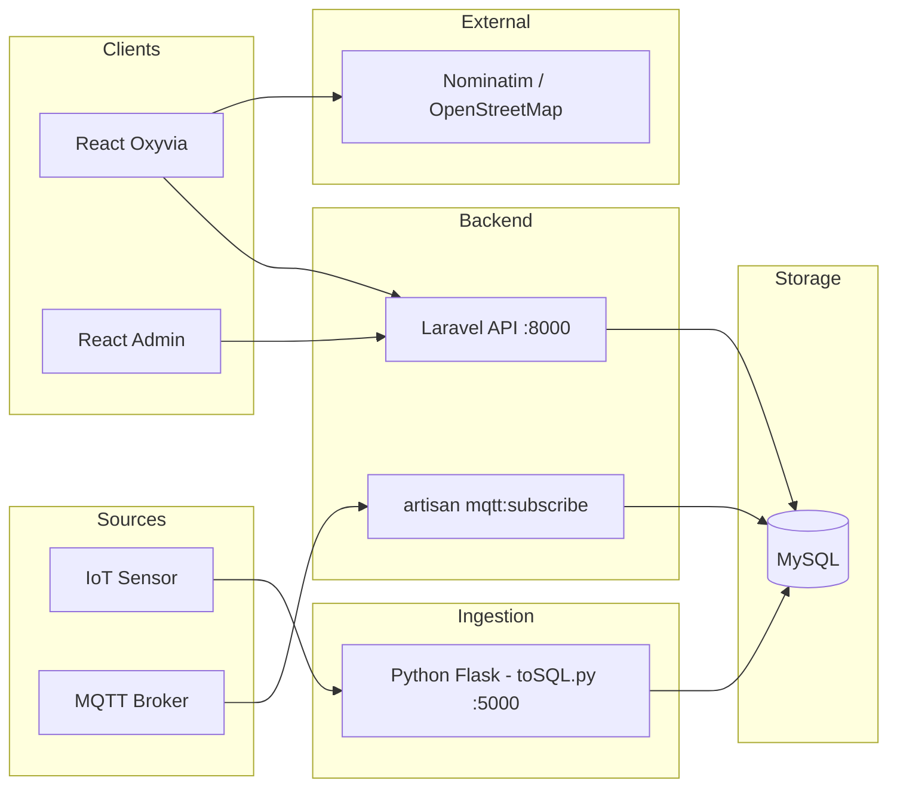
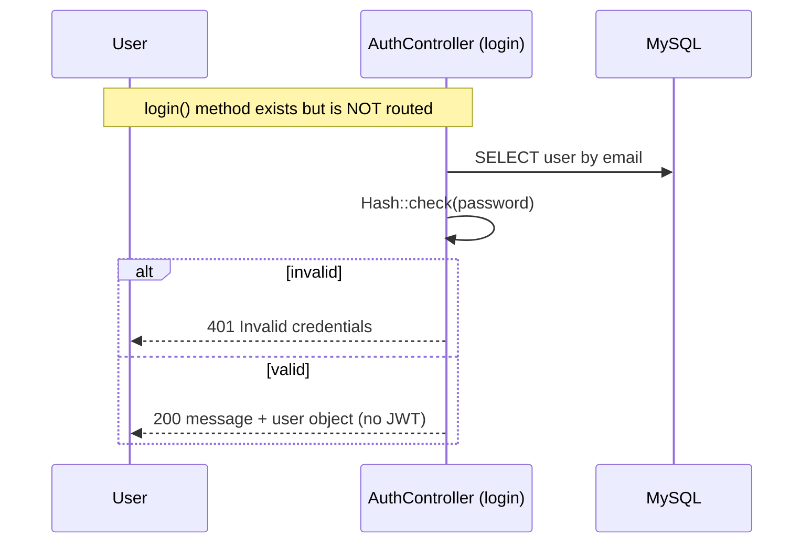

# System Architecture — Oxyvia

## Component Overview

Oxyvia is a **polyglot, multi-service** architecture split into four top-level directories. Each communicates over HTTP (plus an optional MQTT path).

| Component             | Tech            | Responsibility                                                        |
| --------------------- | --------------- | --------------------------------------------------------------------- |
| `python/toSQL.py`     | Python / Flask  | Ingest sensor HTTP payloads, write to MySQL `inputemission`            |
| `backend/` (Laravel)  | PHP 8.2 / Laravel 12 | REST API, auth, users/devices CRUD, input-emission reads, chatbot, MQTT subscriber |
| `frontend/` (React)   | React 19 / Vite | User dashboard: live charts, geolocation, overviews, device mgmt, chatbot |
| `frontend-admin/`     | React 19 / Vite | Admin user-list view                                                    |

## Architecture Diagram

## Communication Details (verified from code)

### Frontend → Backend

- Real-time polling: `frontend/src/view/Dashboard.jsx` calls `GET http://127.0.0.1:8000/api/inputemission` on a **2-second interval** and renders the newest record.
- Device CRUD: `frontend/src/view/Sensor.jsx` and `frontend/src/view/Profile.jsx` call `/api/devices`.
- User operations: `frontend/src/view/Settings.jsx` and `frontend-admin/src/view/Users.jsx` call `/api/users`.
- Overviews: `OverviewPribadi.jsx` / `OverviewKota.jsx` / `Notification.jsx` call `/api/inputemission`.
- Base URLs are **hardcoded** in the components.

### Frontend → External

- Geolocation: browser Geolocation API.
- Reverse geocoding: OpenStreetMap **Nominatim** (`https://nominatim.openstreetmap.org/reverse`).

### Backend → Database

- Eloquent models (`Devices`, `InputEmission`, `User`) plus raw query builder in `AuthController`.
- MySQL per `.env.example` (`energy_dashboard`); SQLite is the code default fallback.

### Ingestion → Database

- The Flask service inserts directly into MySQL (`inputemission`), bypassing the Laravel app for writes.

### Backend → MQTT

- `php artisan mqtt:subscribe` subscribes to `MQTT_TOPIC` and stores messages. **Known gap:** the target `SensorReading` model is absent.

## Authentication Flow

- `register()` hashes the password with `Hash::make`.
- Config `auth.php` defines an `api` guard using the `jwt` driver, but **neither method is registered as a route** (`routes/api.php` has no `/login` or `/register`), and no JWT token is issued.

## Engineering Considerations

- **Polling vs push:** live updates are achieved via 2-second polling; a persistent connection (SSE/WS) is not implemented.
- **Polyglot ingestion:** using a separate Flask service decouples high-frequency ingestion from the Laravel API.
- **MQTT resilience:** the subscriber implements disconnect/reconnect logic, but the storage model is missing.
- **Credentials via environment variables:** the Python ingestion service reads DB credentials from the environment (see `python/.env.example`); hardcoded secrets were removed.
