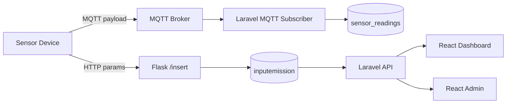
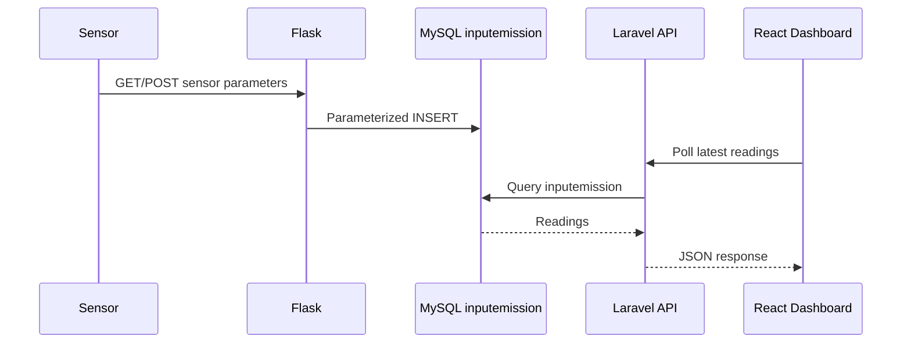
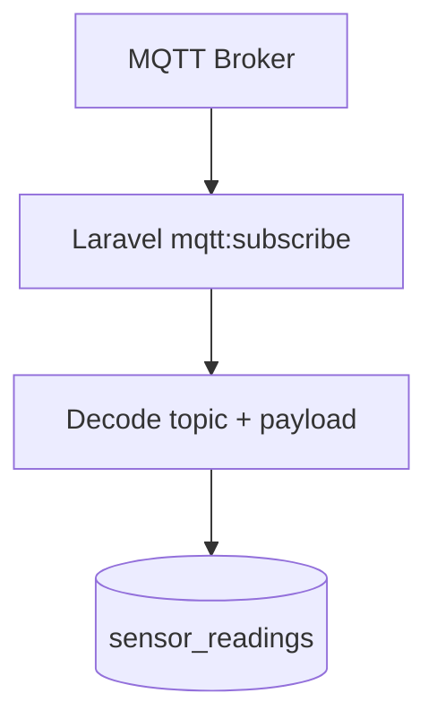
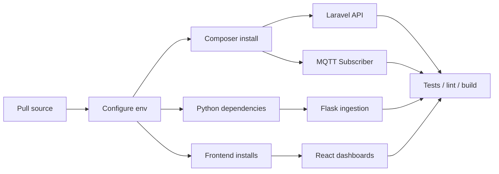
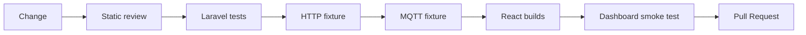
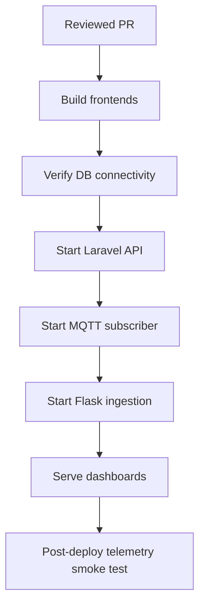

# kiansantangbrokermqtt — Development Pipeline

> Code-grounded architecture and delivery guide for the current repository snapshot. Reviewed from `main` at `b1677238e0ce` on 2026-09-17.

This repository combines two ingestion paths—HTTP via Flask and MQTT via Laravel—with MySQL persistence and React dashboards.

## 1. End-to-end architecture

The HTTP and MQTT paths persist to different tables in the reviewed code. MQTT persistence does not automatically feed `inputemission`.

## 2. Telemetry flow

### HTTP ingestion

### MQTT ingestion

## 3. Runtime ownership

| Layer | Responsibility | Key source |
| --- | --- | --- |
| Flask | HTTP sensor ingestion | `python/toSQL.py` |
| Laravel | API routes + application backend | `backend/routes/api.php` |
| MQTT worker | Subscription and persistence | `backend/app/Console/Commands/MqttSubscribe.php` |
| API controller | Reading retrieval | `InputEmissionController.php` |
| React | Dashboard visualization | `frontend/src/view/Dashboard.jsx` |
| MySQL | Telemetry persistence | `inputemission`, `sensor_readings` |

## 4. Development pipeline

### Declared commands

| Directory | Command | Purpose |
| --- | --- | --- |
| `backend` | `composer dev` | Laravel server + queue + Vite |
| `backend` | `composer test` | Laravel tests |
| `backend` | `npm run build` | Backend Vite build |
| `frontend` | `npm run dev` | User dashboard dev server |
| `frontend` | `npm run build` | User dashboard build |
| `frontend` | `npm run lint` | Frontend lint |
| `frontend-admin` | `npm run dev` | Admin UI dev server |
| `frontend-admin` | `npm run build` | Admin UI build |
| `frontend-admin` | `npm run lint` | Admin UI lint |

## 5. Quality gates

Verify at minimum:

- HTTP reading reaches `inputemission`.
- MQTT fixture reaches `sensor_readings`.
- Missing/invalid sensor parameters fail safely.
- Broker disconnect/reconnect behavior.
- Empty datasets render without breaking the UI.
- Dashboard selects the intended newest reading.
- Public/private API behavior matches the intended auth model.

## 6. Release pipeline

No GitHub Actions workflow was found in the reviewed snapshot; the release gates above are therefore procedural unless CI is added later.

## 7. Known gaps

1. **Two persistence paths:** MQTT writes do not automatically become dashboard `inputemission` records.
2. **Latest-reading selection:** API ordering and the dashboard's array selection should be aligned.
3. **Python environment loading:** `os.getenv` requires the process environment to actually contain the variables; merely copying a `.env` file is insufficient without a loader.
4. **API protection:** inspected data routes are not wrapped in JWT middleware.

## 8. Source map

- [`backend/routes/api.php`](https://github.com/HidayahMF/kiansantangbrokermqtt/blob/b1677238e0ce40b109b243a726c330573e6f7144/backend/routes/api.php)
- [`backend/app/Console/Commands/MqttSubscribe.php`](https://github.com/HidayahMF/kiansantangbrokermqtt/blob/b1677238e0ce40b109b243a726c330573e6f7144/backend/app/Console/Commands/MqttSubscribe.php)
- [`backend/app/Http/Controllers/Api/InputEmissionController.php`](https://github.com/HidayahMF/kiansantangbrokermqtt/blob/b1677238e0ce40b109b243a726c330573e6f7144/backend/app/Http/Controllers/Api/InputEmissionController.php)
- [`python/toSQL.py`](https://github.com/HidayahMF/kiansantangbrokermqtt/blob/b1677238e0ce40b109b243a726c330573e6f7144/python/toSQL.py)
- [`frontend/src/view/Dashboard.jsx`](https://github.com/HidayahMF/kiansantangbrokermqtt/blob/b1677238e0ce40b109b243a726c330573e6f7144/frontend/src/view/Dashboard.jsx)

Update this guide whenever ingestion, persistence, authentication, or telemetry rendering changes.