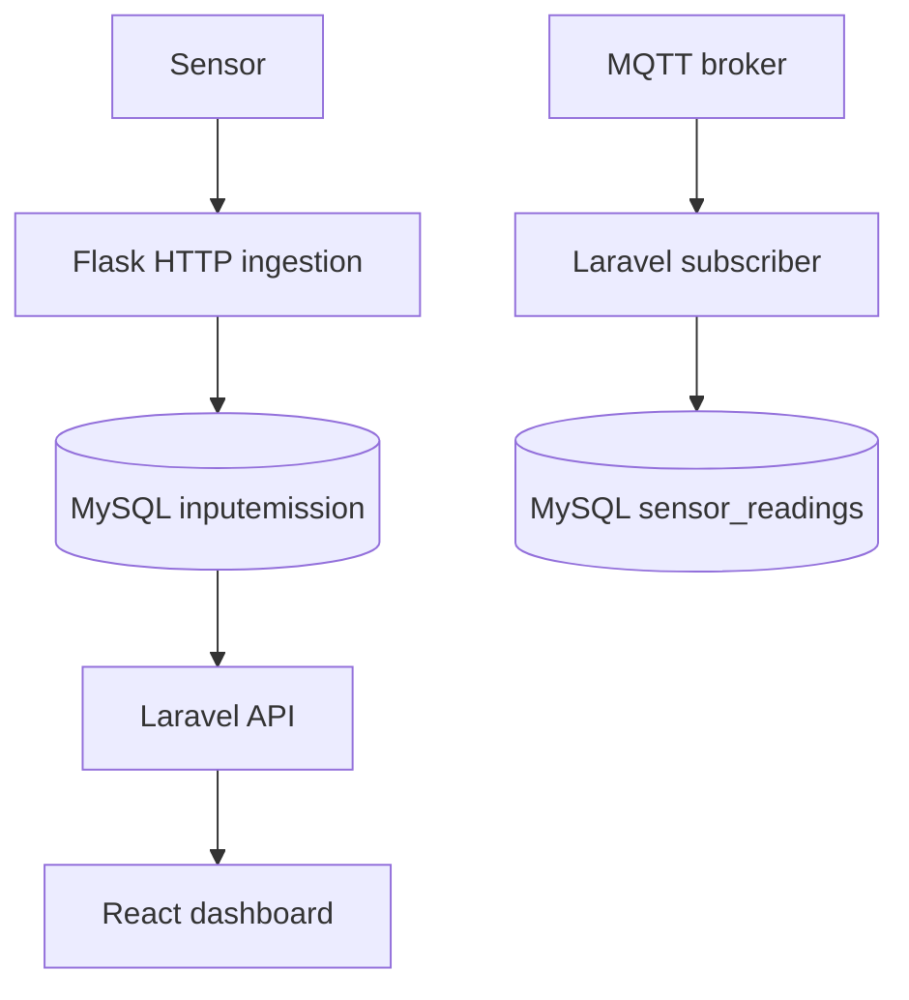

# kiansantangbrokermqtt — Development Pipeline

IoT telemetry platform with separate Flask HTTP ingestion, Laravel MQTT ingestion, MySQL storage, and React dashboards.

> Source review: **2026-09-17**, branch `main`, commit [`b1677238e0ce`](https://github.com/HidayahMF/kiansantangbrokermqtt/commit/b1677238e0ce40b109b243a726c330573e6f7144). This is a code-grounded implementation overview and development guide, not a reconstructed historical timeline or a claim that runtime tests passed.

## At a glance

| Area | Finding |
| --- | --- |
| Review scope | Repository tree, dependency manifests, and selected entry points/domain implementations linked below |
| Automated CI | No files under `.github/workflows/` in this source snapshot |
| Validation performed | Static source and documentation review; application builds, tests, databases, and external services were not executed |

## Implemented flow

1. HTTP sensor parameters enter Flask /insert and are written to inputemission using parameterized SQL.

2. The MQTT subscriber decodes messages and writes topic/payload into sensor_readings; this is a separate table from the dashboard readings.

3. Laravel GET /api/inputemission returns readings; the React dashboard polls every two seconds and renders charts and location information.

### Runtime map

## Source map

Principal source files used for this overview, pinned to the reviewed commit:

- [backend/routes/api.php](https://github.com/HidayahMF/kiansantangbrokermqtt/blob/b1677238e0ce40b109b243a726c330573e6f7144/backend/routes/api.php)
- [python/toSQL.py](https://github.com/HidayahMF/kiansantangbrokermqtt/blob/b1677238e0ce40b109b243a726c330573e6f7144/python/toSQL.py)
- [backend/app/Console/Commands/MqttSubscribe.php](https://github.com/HidayahMF/kiansantangbrokermqtt/blob/b1677238e0ce40b109b243a726c330573e6f7144/backend/app/Console/Commands/MqttSubscribe.php)
- [frontend/src/view/Dashboard.jsx](https://github.com/HidayahMF/kiansantangbrokermqtt/blob/b1677238e0ce40b109b243a726c330573e6f7144/frontend/src/view/Dashboard.jsx)

- [backend/app/Http/Controllers/Api/InputEmissionController.php](https://github.com/HidayahMF/kiansantangbrokermqtt/blob/b1677238e0ce40b109b243a726c330573e6f7144/backend/app/Http/Controllers/Api/InputEmissionController.php)

## Technology and commands

Version ranges below are declarations in source manifests, not independently verified installed versions.

| Manifest | Relevant declarations |
| --- | --- |
| [backend/composer.json](https://github.com/HidayahMF/kiansantangbrokermqtt/blob/b1677238e0ce40b109b243a726c330573e6f7144/backend/composer.json) | `php ^8.2`, `laravel/framework ^12.0`, `php-mqtt/laravel-client ^1.6` |
| [backend/package.json](https://github.com/HidayahMF/kiansantangbrokermqtt/blob/b1677238e0ce40b109b243a726c330573e6f7144/backend/package.json) | `vite ^7.0.4` |
| [frontend-admin/package.json](https://github.com/HidayahMF/kiansantangbrokermqtt/blob/b1677238e0ce40b109b243a726c330573e6f7144/frontend-admin/package.json) | `react ^19.1.1`, `vite ^7.1.7` |
| [frontend/package.json](https://github.com/HidayahMF/kiansantangbrokermqtt/blob/b1677238e0ce40b109b243a726c330573e6f7144/frontend/package.json) | `react ^19.1.1`, `vite ^7.1.7` |

Run each command from the indicated directory after installing the corresponding dependencies and configuring an isolated development environment. Commands are listed as declared; this review does not certify they succeed.

| Directory | Command | Implementation |
| --- | --- | --- |
| `backend` | `composer dev` | Declared: `Composer\Config::disableProcessTimeout; npx concurrently -c "#93c5fd,#c4b5fd,#fdba74" "php artisan serve" "php artisan queue:listen --tries=1" "npm run dev" --names='server,queue,vite'` |
| `backend` | `composer test` | Declared: `@php artisan config:clear --ansi; @php artisan test` |
| `backend` | `npm run build` | Declared: `vite build` |
| `backend` | `npm run dev` | Declared: `vite` |
| `frontend-admin` | `npm run dev` | Declared: `vite` |
| `frontend-admin` | `npm run build` | Declared: `vite build` |
| `frontend-admin` | `npm run lint` | Declared: `eslint .` |
| `frontend` | `npm run dev` | Declared: `vite` |
| `frontend` | `npm run build` | Declared: `vite build` |
| `frontend` | `npm run lint` | Declared: `eslint .` |

## Development sequence

| Stage | Work | Completion evidence |
| --- | --- | --- |
| 1. Establish scope | Read the source map and limitations; choose one concrete behavior to change. | Expected input, output, and failure behavior. |
| 2. Prepare environment | Use the manifests and configuration references. | Required local services reachable with synthetic data. |
| 3. Implement | Follow the implemented flow and update the layer that owns the behavior. | Focused diff with matching caller/callee contracts. |
| 4. Validate | Run applicable declared checks and the scenarios below. | Recorded commands, results, and untested dependencies. |
| 5. Review and release | Review the diff and update documentation; release after environment checks. | Reviewed change and target-environment smoke check. |

These stages are a recommended maintenance sequence, not a historical timeline.

## Configuration and runtime prerequisites

- [backend/.env.example](https://github.com/HidayahMF/kiansantangbrokermqtt/blob/b1677238e0ce40b109b243a726c330573e6f7144/backend/.env.example)
- [backend/phpunit.xml](https://github.com/HidayahMF/kiansantangbrokermqtt/blob/b1677238e0ce40b109b243a726c330573e6f7144/backend/phpunit.xml)
- [frontend-admin/.env.example](https://github.com/HidayahMF/kiansantangbrokermqtt/blob/b1677238e0ce40b109b243a726c330573e6f7144/frontend-admin/.env.example)
- [frontend/.env.example](https://github.com/HidayahMF/kiansantangbrokermqtt/blob/b1677238e0ce40b109b243a726c330573e6f7144/frontend/.env.example)
- [python/.env.example](https://github.com/HidayahMF/kiansantangbrokermqtt/blob/b1677238e0ce40b109b243a726c330573e6f7144/python/.env.example)

Configuration-file presence does not prove deployment success. Keep credentials outside version control and use synthetic records during setup.

## Verification plan

Insert a synthetic HTTP reading and confirm the correct latest value; send an MQTT fixture and verify its separate table; exercise missing parameters, broker disconnects, and empty data.

Test-related files found in the repository tree (10; inventory only, not a passing-test count):

- [backend/tests/Feature/AuthApiTest.php](https://github.com/HidayahMF/kiansantangbrokermqtt/blob/b1677238e0ce40b109b243a726c330573e6f7144/backend/tests/Feature/AuthApiTest.php)
- [backend/tests/Feature/ChatApiTest.php](https://github.com/HidayahMF/kiansantangbrokermqtt/blob/b1677238e0ce40b109b243a726c330573e6f7144/backend/tests/Feature/ChatApiTest.php)
- [backend/tests/Feature/DeviceApiTest.php](https://github.com/HidayahMF/kiansantangbrokermqtt/blob/b1677238e0ce40b109b243a726c330573e6f7144/backend/tests/Feature/DeviceApiTest.php)
- [backend/tests/Feature/ExampleTest.php](https://github.com/HidayahMF/kiansantangbrokermqtt/blob/b1677238e0ce40b109b243a726c330573e6f7144/backend/tests/Feature/ExampleTest.php)
- [backend/tests/Feature/InputEmissionApiTest.php](https://github.com/HidayahMF/kiansantangbrokermqtt/blob/b1677238e0ce40b109b243a726c330573e6f7144/backend/tests/Feature/InputEmissionApiTest.php)
- [backend/tests/Feature/UserApiTest.php](https://github.com/HidayahMF/kiansantangbrokermqtt/blob/b1677238e0ce40b109b243a726c330573e6f7144/backend/tests/Feature/UserApiTest.php)
- [backend/tests/Pest.php](https://github.com/HidayahMF/kiansantangbrokermqtt/blob/b1677238e0ce40b109b243a726c330573e6f7144/backend/tests/Pest.php)
- [backend/tests/TestCase.php](https://github.com/HidayahMF/kiansantangbrokermqtt/blob/b1677238e0ce40b109b243a726c330573e6f7144/backend/tests/TestCase.php)
- [backend/tests/Unit/ExampleTest.php](https://github.com/HidayahMF/kiansantangbrokermqtt/blob/b1677238e0ce40b109b243a726c330573e6f7144/backend/tests/Unit/ExampleTest.php)
- [backend/tests/Unit/MqttParsePayloadTest.php](https://github.com/HidayahMF/kiansantangbrokermqtt/blob/b1677238e0ce40b109b243a726c330573e6f7144/backend/tests/Unit/MqttParsePayloadTest.php)

## Known limitations and next work

MQTT persistence does not automatically feed inputemission. The API sorts readings newest-first while Dashboard.jsx selects the last item, so its current-reading selection needs correction. Flask reads process environment with os.getenv; copying a .env file alone does not load it. Data routes in routes/api.php are not wrapped in JWT middleware.

Prioritize the acceptance checks above before expanding the feature set. A declared test command or example test does not establish production readiness.

## Keeping this document accurate

Update the source snapshot and affected flow when entry points, persistence, authentication, or integration contracts change. Keep planned capabilities separate from implemented behavior, and record actual build/test results only after running them.
