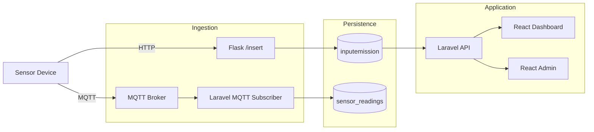
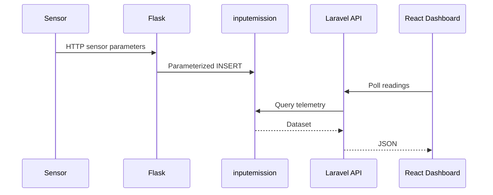
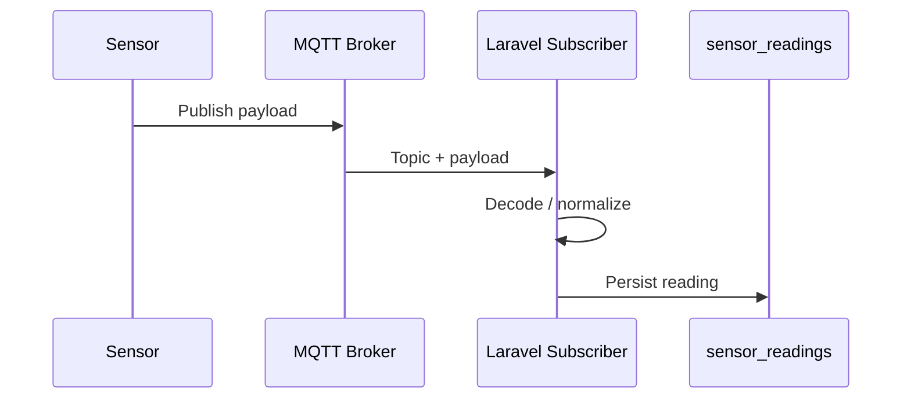
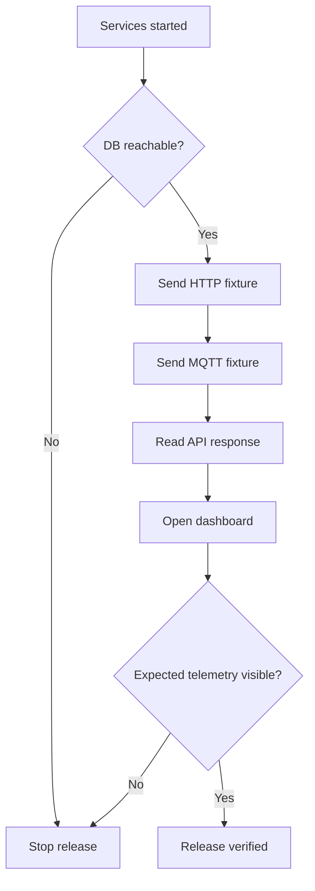

# 🌐 kiansantangbrokermqtt — Engineering Blueprint

> **IoT telemetry pipeline:** dual HTTP + MQTT ingestion, MySQL persistence, Laravel APIs, and React dashboards.

**Reviewed snapshot:** `main` @ [`b1677238e0ce`](https://github.com/HidayahMF/kiansantangbrokermqtt/commit/b1677238e0ce40b109b243a726c330573e6f7144) — 2026-09-17

## ⚡ System snapshot

| Domain | Implementation |
| --- | --- |
| HTTP ingestion | Flask → `inputemission` |
| MQTT ingestion | Broker → Laravel subscriber → `sensor_readings` |
| API | Laravel |
| Dashboard | React |
| Admin UI | React |
| Persistence | MySQL |
| Automated CI | No `.github/workflows/` found in reviewed snapshot |

## 🏗️ End-to-end architecture

> **Important:** the reviewed source contains **two separate persistence paths**. MQTT records do not automatically become `inputemission` dashboard records.

## 🔀 Data journey

## 🗺️ Code ownership map

| Layer | Source | Owns |
| --- | --- | --- |
| Flask ingestion | [`python/toSQL.py`](https://github.com/HidayahMF/kiansantangbrokermqtt/blob/b1677238e0ce40b109b243a726c330573e6f7144/python/toSQL.py) | HTTP sensor insert |
| API routes | [`backend/routes/api.php`](https://github.com/HidayahMF/kiansantangbrokermqtt/blob/b1677238e0ce40b109b243a726c330573e6f7144/backend/routes/api.php) | HTTP API surface |
| MQTT worker | [`MqttSubscribe.php`](https://github.com/HidayahMF/kiansantangbrokermqtt/blob/b1677238e0ce40b109b243a726c330573e6f7144/backend/app/Console/Commands/MqttSubscribe.php) | Broker subscription |
| Reading API | [`InputEmissionController.php`](https://github.com/HidayahMF/kiansantangbrokermqtt/blob/b1677238e0ce40b109b243a726c330573e6f7144/backend/app/Http/Controllers/Api/InputEmissionController.php) | Dashboard telemetry response |
| Dashboard | [`Dashboard.jsx`](https://github.com/HidayahMF/kiansantangbrokermqtt/blob/b1677238e0ce40b109b243a726c330573e6f7144/frontend/src/view/Dashboard.jsx) | Polling + visualization |

## 🚀 Developer → release pipeline

```mermaid
flowchart LR
    A[Change request] --> B[Trace owning layer]
    B --> C[Configure isolated env]
    C --> D[Implement focused change]
    D --> E[Backend tests]
    E --> F[Frontend lint/build]
    F --> G[HTTP telemetry fixture]
    G --> H[MQTT telemetry fixture]
    H --> I[Dashboard smoke test]
    I --> J[PR review]
    J --> K[Target-env deploy]
    K --> L[Post-deploy telemetry check]
```

### Declared commands

| Area | Commands |
| --- | --- |
| Laravel | `composer dev`, `composer test`, `npm run build` |
| User frontend | `npm run dev`, `npm run build`, `npm run lint` |
| Admin frontend | `npm run dev`, `npm run build`, `npm run lint` |

## 🛡️ Quality gates

| Gate | Must prove |
| --- | --- |
| HTTP ingestion | Synthetic reading reaches `inputemission` |
| MQTT ingestion | Fixture reaches `sensor_readings` |
| Error handling | Missing params / broker failures fail safely |
| Data semantics | Dashboard chooses the intended newest reading |
| UI | Empty datasets do not break rendering |
| Auth | Public/private routes match the intended security model |
| Release | Telemetry still moves end-to-end after deployment |

## ⚠️ Risk radar

| Priority | Finding | Impact |
| --- | --- | --- |
| 🔴 High | MQTT and HTTP land in different tables | Dashboard may not represent MQTT telemetry automatically |
| 🔴 High | API ordering vs dashboard array selection differ | “Current” reading can be the wrong record |
| 🟠 Medium | Flask uses `os.getenv` | Copying `.env` alone does not load variables |
| 🟠 Medium | Inspected data routes are not wrapped in JWT middleware | Route exposure should be checked against intended access |

## 🧪 Release smoke path

## 📌 Documentation rule

This blueprint describes **implemented source behavior**, not an assumed infrastructure state. No GitHub Actions workflow was found in the reviewed snapshot, so the quality/release gates above remain procedural until CI is added.

---

### Keeping this blueprint accurate

Update the reviewed commit, diagrams, and risk radar whenever ingestion, persistence, API protection, or dashboard reading semantics change.
