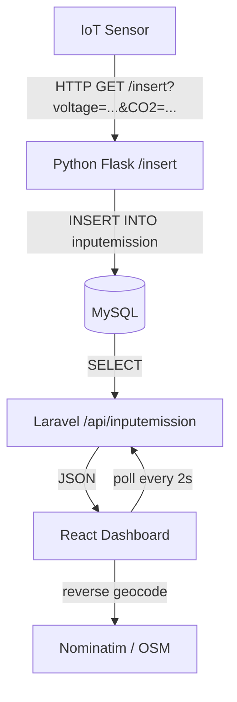
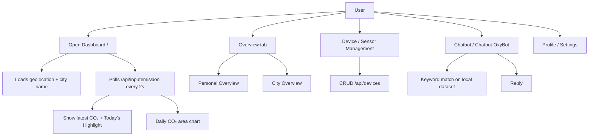
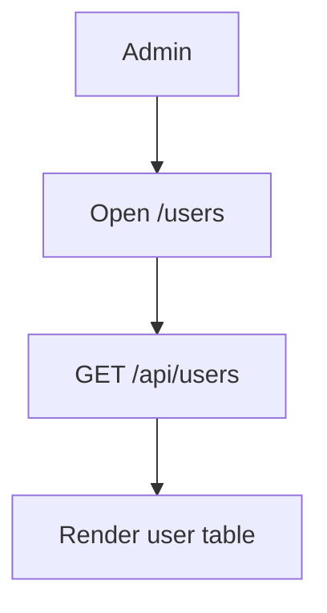
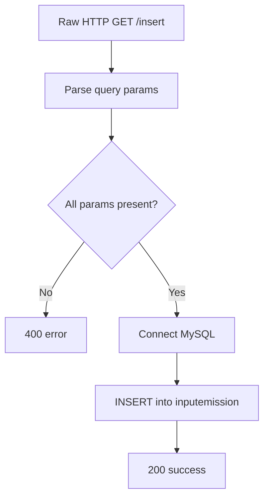

# Product Flow — Oxyvia

This document describes the flows supported by the actual code in the repository.

## System Data Flow



## User (Dashboard) Flow

Verified entry points come from `frontend/src/router/Router.jsx` and the view components.



## Admin Flow

Verified in `frontend-admin` (`App.jsx`, `Router.jsx`, `view/Users.jsx`).



## Ingestion Flow (Python)

Verified in `python/toSQL.py`.



## MQTT Flow (Backend Command)

Verified in `backend/app/Console/Commands/MqttSubscribe.php`.

```mermaid
flowchart TD
    B[BROKER] -->|publish to topic| SUB[Subscribe]
    SUB --> MSG[On message]
    MSG --> STORE[Persist payload]
    STORE --> ERR{Error?}
    ERR -- yes --> LOG[Log error]
    LOOP[loop(true)]
    LOOP --> CRASH{Exception?}
    CRASH -- yes --> RECON[Reconnect + resubscribe]
    CRASH -- no --> LOOP
```

> The persistence call in `MqttSubscribe` targets `App\Models\SensorReading`, which maps to the `sensor_readings` table created by the migration `2026_08_27_000002_create_sensor_readings_table.php`.
